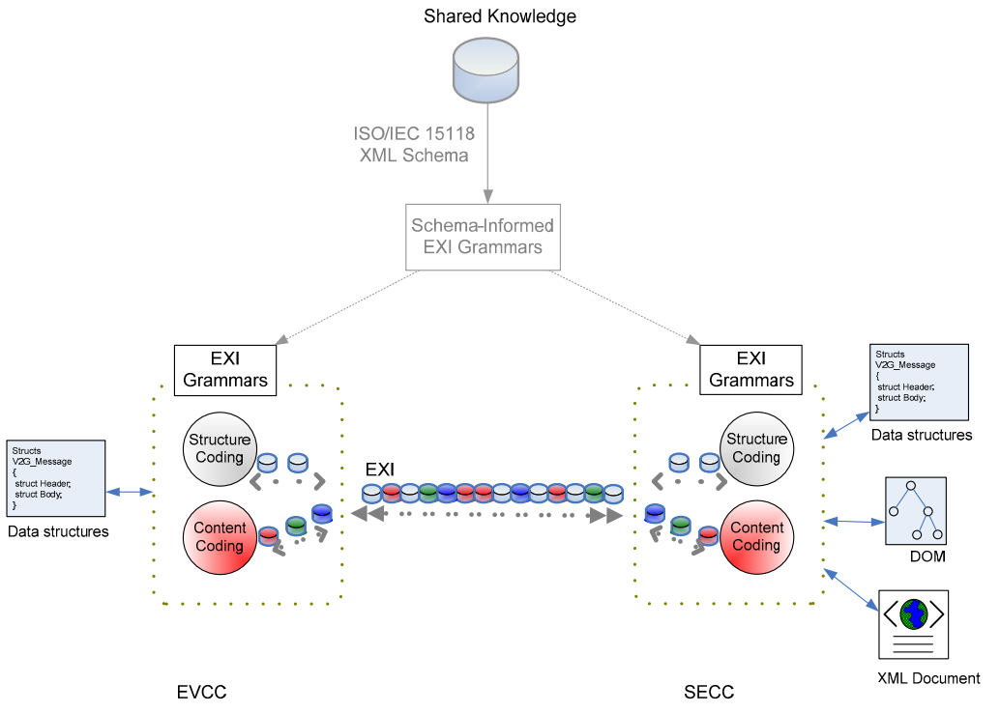
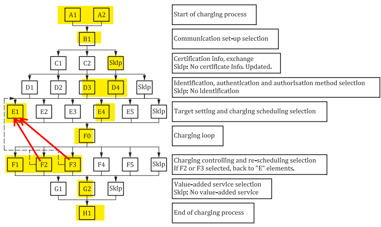
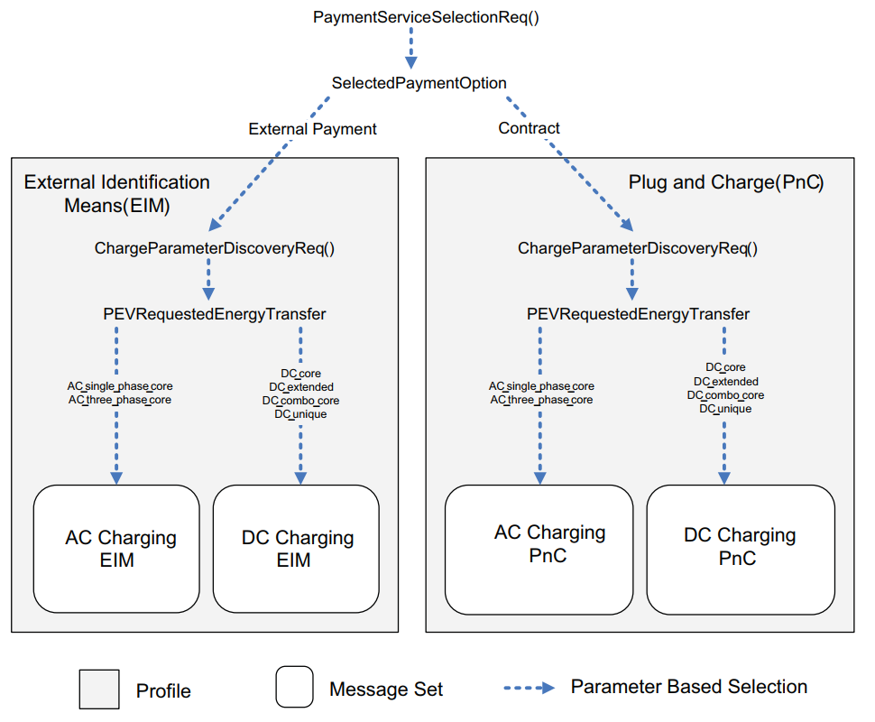
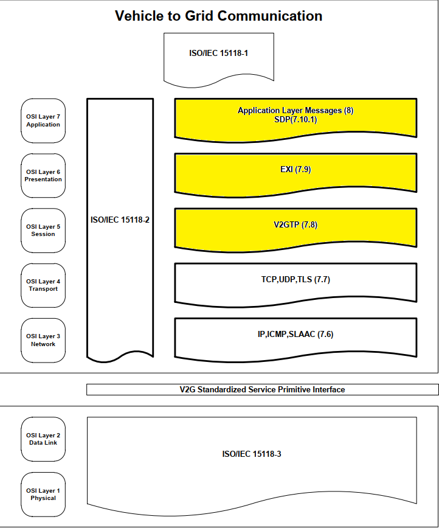
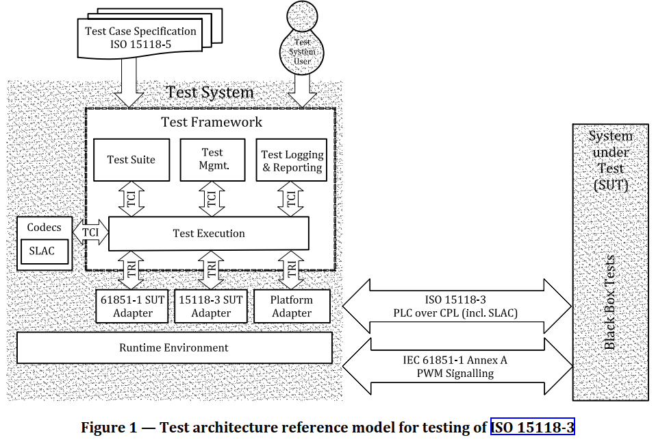
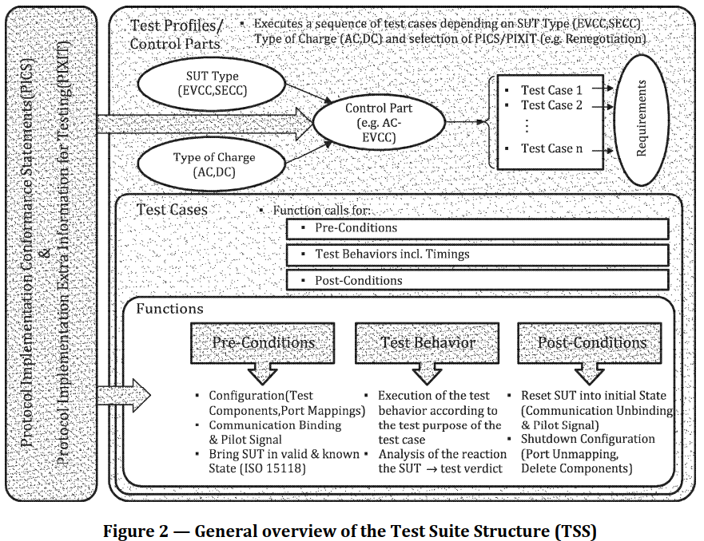

# **HIGH LEVEL COMMUNICATION - ISO15118 - Road vehicles - Vehicle to grid Communication interface**
Description: EV side EVCC emulation for Charging Station SECC HLC testing. Interface testing for HLC of ICU board on CP line of charging cable.  
The communication channel shall consist of basic signalling and/or HLC.  
HLC exchanges XML‑based messages with TCP/IP protocol, to provide extended functions  
Basic signalling(Control Pilot) always available. HLC shall be enabled by basic signalling.  

HLC-based charging session:
- data link setup;
- V2G setup;
- V2G charging loop.

**Communication architecture set-up**  

## I. Part 3: Physical and data link layer requirements (ISO 15118-3)
*(OSI layer 1-2 and V2G standardized service primitive interface)*  
[Ref document]  
- Information about connection, matching EV-EVSE process and timing constraints

## II. Part 2: Network and application protocol requirements (ISO 15118-2)
*(OSI layer 3-4-5-6-7)*

### **1. Network layer**
EV and EVSE communication controller shall implement Network Layer with IPv6
- optional DHCP (EV server, EVSE client)
- Neighbor Discovery (EVSE auto assign IPv6 Address)
- Internet Control Message Protocol (handling msg error)
- Stateless Auto Address Configuration (SLAAC): auto generate IPv6 address base on device MAC address.

### **2. Transport layer**
- TCP
- UDP (implementation required but no use case available)
- TLS

### **3. V2GTP**
*Vehicle to Grid Transfer Protocol*  
Protocol to transfer V2G message between 2 V2GTP entities (TLS + TCP)  
PDU structure: Big endian format
- Header(8 bytes)  
  * Protocol version : 1 byte
  * Inverse protocol version : 1 byte
  * Payload type : 2 byte (8001 - EXI encode V2G message / 9000:9001 SDP request response)
  * Payload length: 4 byte (payload length value)  
- Payload(0-4294967295 Bytes)

### **4. Presentation Layer**
V2G Message shall be present in EXI format. Application layer data shall be
send with XML EXI format & encrypted.  

> TODO: Check EXI format and XML schema

### **5. Application Layer**
A V2G message uses the EXI-based Presentation Layer.  
Client/server architecture, The EVCC always acts as a client (service requester) during the entire charging process, whereas the SECC always acts as a server (service responder)  

- SECC Discovery Protocol (setup connection, handshake phase)
- Application layer service (operation and msg list)
  - Operation:
    - Request (EVCC)
    - Response (SECC)
    - Indication (SECC)
    - Confirmation (EVCC)
  - Msg list:
    - Session Setup
    - Service Discovery
    - Service Detail
    - Service and Payment Selection
    - Payment Details
    - Charge Authorization
    - Charge Parameter Discovery
    - Power Delivery
    - Charging Status
    - Metering Receipt
    - Certificate update
    - Certificate installation
    - Cable Check
    - Pre Charging
    - Current Demand
    - Welding Detection
    - Session Stop

## III. Part 1: General information and use-case definition (ISO 15118‑1)
  General use case - system test case operation

**A: Start of communication session**
- [A1] 7.3.2 Plug-in and forced HLC
- [A2] 7.3.4 Plug-in with concurrent IEC 61851-1 and HLC

**B: Communication set-up**
- [B1] 7.4.1 EVCC/SECC conductive communication set-up

[skip] [C: Certificate handling (for PnC)]

**D: Identification and authorization**  
EIM where the identification/authorization is performed
- [D3] 7.6.4 Authorization at the EV supply equipment using external credentials performed at the EV supply equipment (RFID)
- [D4] 7.6.5 Authorization at the EV supply equipment using external credentials performed with the help of an SA (QR code App scanning)

**E: Target setting and energy transfer scheduling**
- [E1] 7.8.1 AC charging with load levelling based on HLC
- [E3] 7.8.3 Optimized charging with scheduling from secondary actors (smart charging)
- [E4] 7.8.4 DC charging with load levelling based on HLC
- [E5] 7.8.5 Resume to authorized charging schedule (smart charging)
- [E8] 7.8.8 Fast responding energy transfer services based on dynamic control mode (smart charging)

**F: Energy transfer controlling and re-scheduling**
- [F0] 7.9.1 Energy transfer loop
- [F1] 7.9.2 Energy transfer loop with metering information exchange
- [F2] 7.9.4 Energy transfer loop with interrupt from the SECC
- [F3] 7.9.5 Energy transfer loop with interrupt from the EVCC or USER
- [F4] 7.9.6 Energy transfer control based on dynamic control mode (smart charging)

**G: Value-added services**
- [G2] 7.10.3 Energy transfer details

**H: End of energy transfer process**
-  [H1] 7.11.2 End of energy transfer process  
  

Current CS only support EIM (no Plug&Charge)  
MessageSets base on payment methods:  
  

## IV. Test environment
Implement in C++
Libraries:
- asio: provides the basic building blocks for C++ networking, concurrency and other kinds of I/O  
  
- fmt: formatting library providing a fast and safe alternative to C stdio and C++ iostreams.
- cppcommon: common cpp libraries  

**Vehicle to Grid Communication**  

**XML Schema**  
- “V2G_CI_AppProtocol”: Defines the protocol handshake messages  
- “V2G_CI_MsgDef”: Defines the message structure Definition  
- “V2G_CI_MsgHeader”: Defines the message Header  
- “V2G_CI_MsgBody”: Defines the message Body  
- “V2G_CI_MsgDataTypes”: Defines the data types  
- "xmldsig-core-schema": Defines the W3C schema for XML signatures  
*XML dependency graph*  
  

**OpenV2G implementation**  
EXI corresponding data type is implemented in EXIDataTypes.h of din/iso1/iso2 folder.
root data structure:
iso1EXIFragment
  - fragment data
  - fragment used flag
iso1EXIDocument
  - iso1AnonType_V2G_Message
    - iso1MessageHeaderType
      - sessionID, Notification, Signature
    - iso1BodyType
      - message specific body data struct
      - message type enable flag
  - message_type_enable_flag

use EXIDocument, initExiDocument, initBody, initMessageSpecific

# hlc test framework directory structure
1. /CMakeLists.txt: root cmake file for project build generation (build testcase(cpp) in test folder)
2. /cmake
     - contain all module cmake script, shall be called by CMakeLists.txt in root dir
3. modules(lib)
     - asio: for IPv6, TCP, UDP, SSL, TLS, Socket io
     - fmt: format lib
     - cpp: common cpp lib
     - openssl: encryption (external environment)
     - wiringPi: control raspberry gpio
     - openv2g: v2g lib (c code of message data structure for encode/decode as EXI format)
       - appHandshake: encode/decode application handshake msg
       - codec     encode/decode bits stream
       - din    |
       - iso1   |  C code for EXI XML FORMAT (encode/decode): input data structure -> output data stream | input data stream out put -> output data structure
       - iso2   |
       - transport: v2g transport (add header to data stream)
       - xmldsig: EXI digital signature (add digital signature to header)

4. include & src: implementation for HLC test framework
     - /messages/class: specific class for each message EXI -> class attribute -> set/get data (inheritance from V2gExiMessage)
     - CPState: control resistor for basic signalling (ControlPilot)
     - V2gAppHandleMessage: handle application level protocol handshake phase
     - V2gEvccControllerStub: stub function
     - V2gEvccCommSession: handle communication session
     - V2gEvccMessageHandler: handle messages event
     - V2gEvccState: handle state transition base on event
     - V2gExiMessage: pass data from application layer(class) to EXI presentation layer byte stream (inheritance from V2gTpMessage)
     - V2gSdpMessage/V2gSdpResMessage: SECC discovery protocol for handle Network layer connection (discovery SECC IPv6, Port) <- UDP client (inheritance from V2gTpMessage)
     - V2gTpMessage: base message class
     - V2gTpSsl: SSL Transport layer
     - V2gTcpClient: TCP layer (send EXI V2gExiMessage, TCP event)
     - V2gUdpClient: UDP layer (for SECC Discover Protocol)

5. test: test folder (all test cpp, h, inl files put here)
    - cmake shall generate make to build each cpp source file (test case) with header/inline file and libs.

> To execute: create build folder in current dir
> cd to build, type cmake .., then make to build all test case in test folder

# TEST FRAMEWORK IMPLEMENTATION  
**TEST SYSTEM DESIGN**  

**TEST SUITE**  
  

Test case:  
- Initialize:
  - create MTC/PTC component
  - map MTC/PTC/system ports and communication
- Precondition: Bring SUT and tester to a valid and known state
- Test behavior: actual action during execution to achieve the test purpose and assign verdicts to the possible outcomes
  - Initialize and start relevant timer(s) on the tester side.
  - Execute test behavior (send stimulus to the SUT).
  - Listen to any event and verify SUT response (stop timer).
  - Assign test verdict
- Post condition: Bring SUT and tester to final/initial state.
- Shutdown:
  - Unmap connected port and communication bindings
  - Shutdown test component  

NAMING CONVENTION:                                                                                    
[sut]    System under Test   
EVCC  Electric Vehicle Communication Controller  
SECC  Supply Equipment Communication Controller  
CMN  Common (exclusively for template modules)  
 
[dom]    Domain  
AC  AC specific behaviors  
DC  DC specific behaviors  
CMN  Common behaviors  
 
[ctx]  {fullname}  Context (e.g. name of message pattern signal name according to standard)  
 
[<modtype>]    Module type  
TestCases  Module including test cases  
Functions  Module including functions  
Templates  Module including templates  
 
[<ttyp>]    Type of testing  
VTB  Valid test behavior  
ITB  Invalid test behavior  
 
[<nn>]  {xxx}  Sequential number from 001 to 999  
 
[<pic>]    Protocol implementation capability  
PICS  Protocol Implementation Conformance Statement  
PIXIT  Protocol Implementation extra Information for Testing  
 
Testcase: TC_[<sut>]_[<dom>]_[<ttyp>]_[<ctx>]_[<nn>]  
 
Template: [<prefix>]_[<sut>]_[<dom>]_[<dtyp>]_[<nn>]  
 
Function: f_[<sut>]_[<dom>]_[<ttyp>]_[<ctx>]_[<nn>]  
 
Timer: Local: t_[ctx], in component: tc_[ctx] 
 
PICS/PIXIT: [<pic>_<sut>_<dom>_<ctx>]  
 
VERDICT: 
none  Is implicitly assigned in the beginning of  
every test case by default and is reported  
as a final verdict in the absence of any  
other verdict assignment during the test  
case execution.  
No TSS specific definition (see TTCN‐3  
definition).  
pass  Means that everything is OK. A verdict  
given when the observed outcome  
satisfies the test purpose and is valid with  
respect to the relevant requirements and  
with respect to the PICS. [ITU‐T X.290]  
If in review of a requirement the SUT has a  
correct behavior, then this verdict type shall be  
used.  
inconc  A verdict given when the observed  
outcome is valid with respect to the  
relevant requirements but prevents the  
test purpose from being accomplished.  
[ITU‐T X.290]  
Means that neither pass nor fail can be reliably  
assigned.  
fail  A verdict given when the observed  
outcome is syntactically invalid or  
inopportune with respect to the relevant  
requirements or the PICS/PIXIT.  
[ITU‐T X.290]  
If in review of a requirement the SUT has a  
wrong behavior, then this verdict type shall be   used.  

add_executable(execute test suite), target_sources : https://cmake.org/cmake/help/latest/command/add_executable.html#normal-executables  
add_library(shared|static|object|interface|alias|imported [global ])